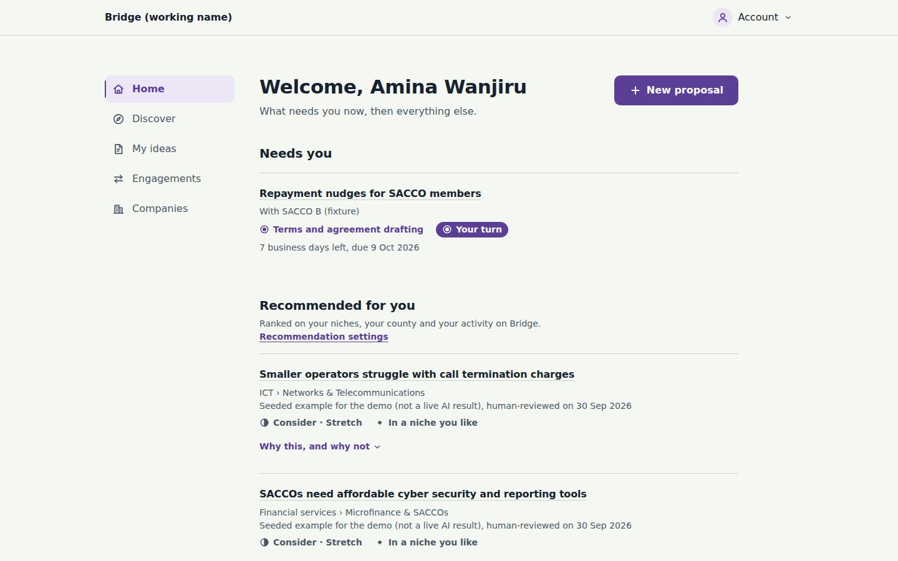
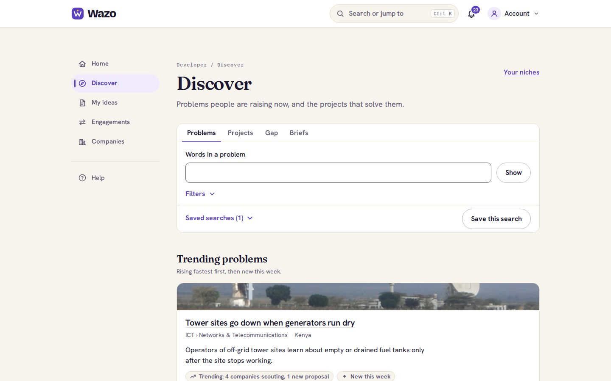
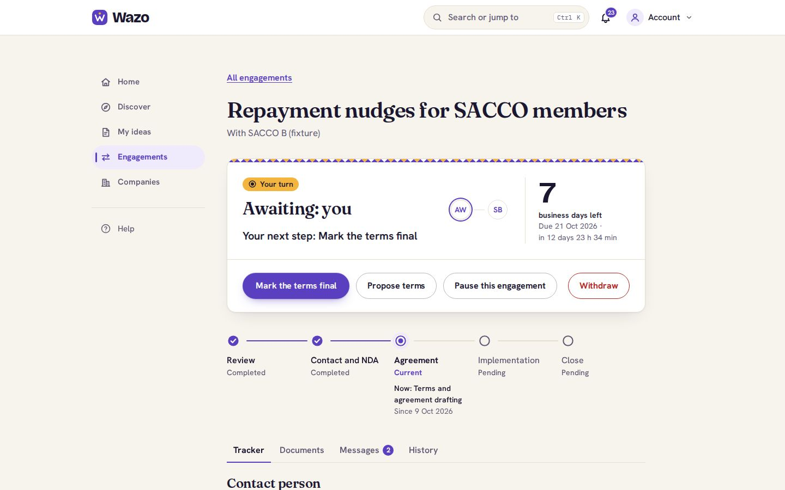
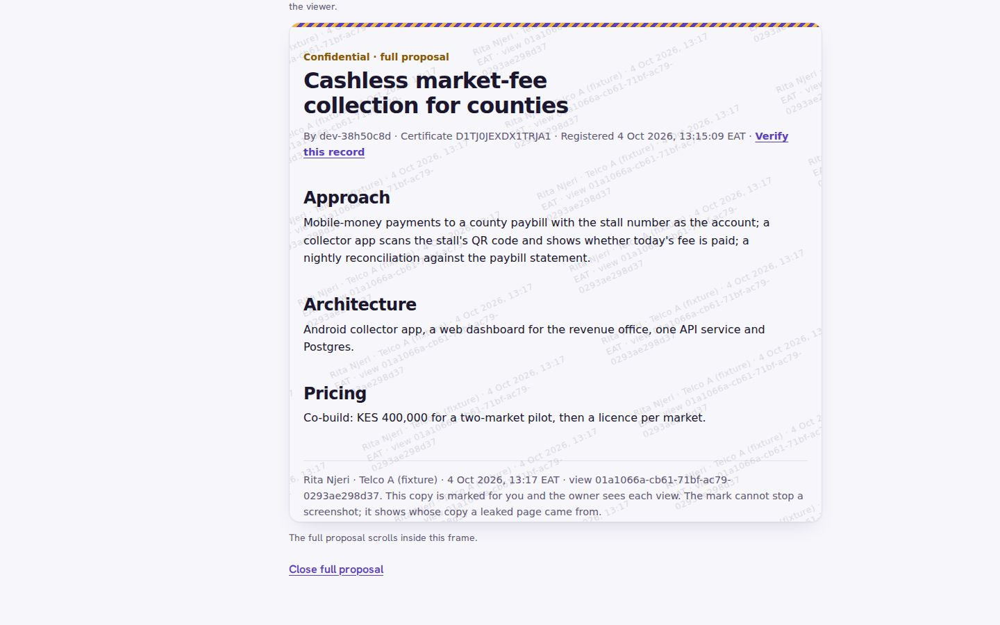
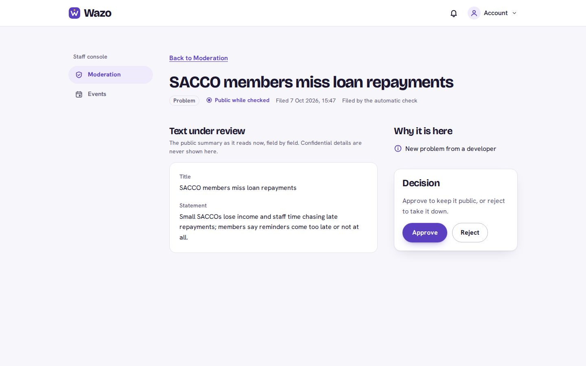
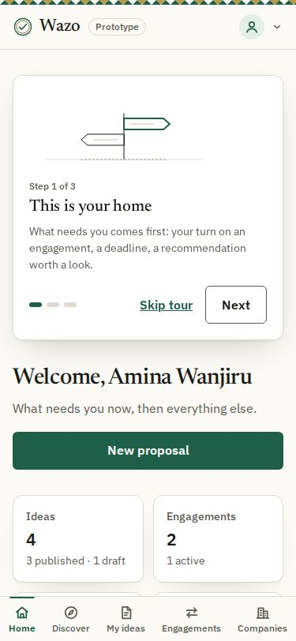
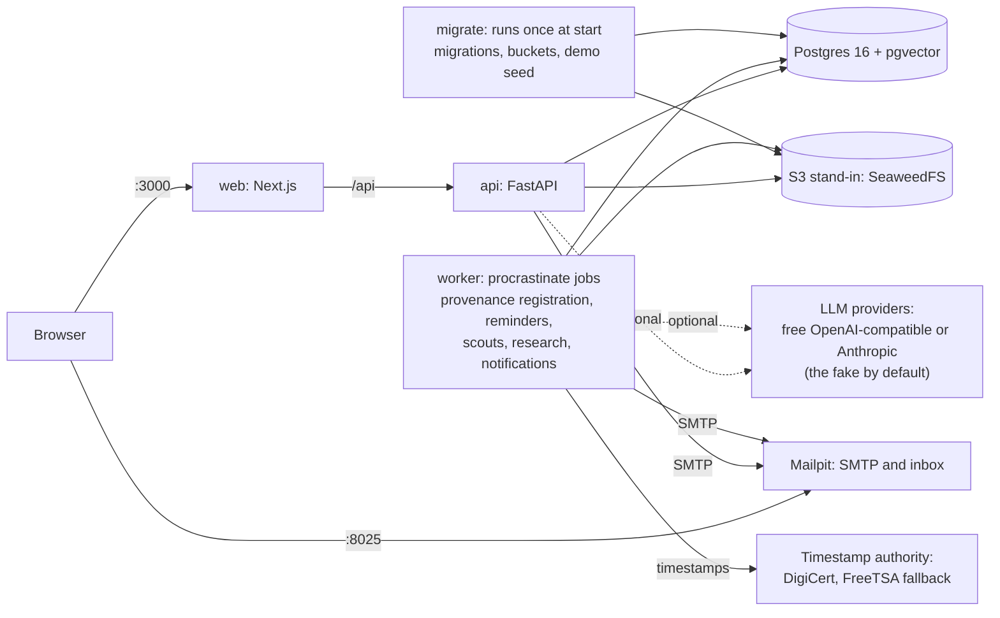

# Agentic Second Brain

## Project reminders (current)

Every morning a **LangGraph** workflow looks at the project folders on this laptop,
finds the ones that have gone cold (no work for 3 days, or uncommitted/unpushed work
left sitting), sends an **investigator agent** with read-only tools into each one to
work out where you left off and what the next 15-minute step is, then reminds you by
**email** and **WhatsApp**. Plain code decides whether and when anything is sent; the
agent only decides what to say. No Docker, no n8n.

```powershell
python -m venv .venv && .venv\Scripts\python.exe -m pip install -r requirements.txt
.venv\Scripts\python.exe -m reminder --dry-run                      # watch the agent; sends nothing
powershell -ExecutionPolicy Bypass -File scripts\install-reminder-task.ps1   # schedule it
```

Setup, settings (`reminders.json`), behaviour and troubleshooting:
[`docs/10-project-reminders.md`](docs/10-project-reminders.md).

| Path | Purpose |
|------|---------|
| [`reminder/graph.py`](reminder/graph.py) | the LangGraph workflow + investigator agent |
| [`reminder/tools.py`](reminder/tools.py) | the agent's read-only, sandboxed tools |
| [`reminder/scan.py`](reminder/scan.py) | project discovery, git state without git |
| [`reminder/remind.py`](reminder/remind.py) | policy, email, once-a-day delivery, CLI |
| [`reminder/notify.py`](reminder/notify.py) | Gmail SMTP + Meta WhatsApp Cloud API |
| [`reminders.example.json`](reminders.example.json) | settings template (live copy `reminders.json` is gitignored) |
| [`tests/`](tests/) | `.venv\Scripts\python.exe -m unittest discover -s tests -t .` |
| [`scripts/install-reminder-task.ps1`](scripts/install-reminder-task.ps1) | register with Task Scheduler |

## WhatsApp voice adviser (two-way, current)

Reply to the reminder, or message any time, by **text or voice note**. A second
LangGraph agent, with read-only tools over *every* project, answers like a senior dev
mentor, and a voice note gets a **fluent voice note back**. It remembers the
conversation, and it can pause or finish a project's reminders only after you say yes.
Free stack: Groq Whisper (speech-to-text) + Groq models + edge-tts voices + a
Cloudflare tunnel that re-registers itself with Meta.

```powershell
.venv\Scripts\python.exe -m adviser check      # what is set up (needs WA_APP_SECRET in .env)
.venv\Scripts\python.exe -m adviser chat       # try the brain in the terminal first
.venv\Scripts\python.exe -m adviser serve      # go live on WhatsApp
powershell -ExecutionPolicy Bypass -File scripts\install-adviser-task.ps1 -StartNow   # keep it running
```

Setup, commands, limits and troubleshooting:
[`docs/11-whatsapp-voice-adviser.md`](docs/11-whatsapp-voice-adviser.md).

| Path | Purpose |
|------|---------|
| [`adviser/turn.py`](adviser/turn.py) | one conversation turn as a LangGraph workflow (hear, route, think, speak, deliver) |
| [`adviser/brain.py`](adviser/brain.py) | the adviser agent, its cross-project tools, the Groq model pool |
| [`adviser/speech.py`](adviser/speech.py) | Whisper speech-to-text, edge-tts, OGG/Opus voice notes |
| [`adviser/whatsapp.py`](adviser/whatsapp.py) | webhook signature/parsing, media, voice-note sends |
| [`adviser/server.py`](adviser/server.py) · [`adviser/tunnel.py`](adviser/tunnel.py) | webhook server; Cloudflare tunnel + Meta registration |
| [`adviser/memory.py`](adviser/memory.py) | conversation memory, dedupe, confirmed reminder changes |

## Hosted platform (in development)

A hosted developer ⇄ organisation platform is being built in this repository under `backend/`, `frontend/` and
`infra/`, following the spec in [`docs/spec/`](docs/spec/) and the plan in [`docs/platform/`](docs/platform/). It does
not change or import the local companion above. Local setup: [`docs/runbooks/dev-setup.md`](docs/runbooks/dev-setup.md).

### Run the demo (`make demo`)

A seeded local copy of the platform for demos: two developers, four fixture organisations, two staff accounts,
published proposals with certificates, pitches and engagements at several stages, a scout, research cards, trending
problems and staff queues. Nothing is paid for and nothing leaves the laptop except the certificate timestamps (below).
Its sample plan prices are placeholders and its checkout is a simulation: see "Real, simulated or planned".

**You need** Docker Desktop (Windows: the WSL 2 backend), Git and Python 3.9 or later (the same Python as the companion
above); `make` is optional (below). Give Docker 4 GB of memory: on Windows with the WSL 2 backend, memory is set in
`%UserProfile%\.wslconfig`, not in Docker Desktop (a file with the two lines `[wsl2]` and `memory=4GB`, then
`wsl --shutdown` and start Docker Desktop again); on macOS, Docker Desktop → Settings → Resources. If a build is killed for lack of memory (the first build is the
heaviest), close other applications and run `make demo` (or `python infra/demo/demo.py up`) again: it builds and starts
whatever is missing, and Docker reuses the image layers that were already built. Run `make demo-reset` instead if the
seed step was the one interrupted (below). The demo's
containers are capped at 2.75 GB in all (the limits in `infra/docker-compose.demo.yml`). TODO(orchestrator): memory
(the measured use per container after a clean `make demo-reset`, from `make demo-stats`).

**Start it** from the repository folder, in PowerShell or Git Bash:

1. `python infra/demo/demo.py up` (or `make demo`). The first run writes throwaway secrets to `infra/demo/.env` and
   `infra/demo/backend.env` (both gitignored and readable only by you; never commit them), creates `backend/.env` from
   `backend/.env.example` if it is missing, builds the images (several minutes the first time), starts Postgres,
   Mailpit, the S3 stand-in, the API, the worker and the web app, seeds the data and prints the addresses and logins.
   Later starts keep the data and leave whatever you did in the app as it is.
2. Open the web app and sign in with a login below; the second factor is a TOTP code from
   `python infra/demo/demo.py totp` (`make demo-totp`).

Every `make demo-…` target is a short `python infra/demo/demo.py …` command, so `make` is not needed; Windows and Git for
Windows do not include it (install GNU make, for example with Chocolatey's `choco install make`, if you want the
targets). On macOS and Linux, where `python` may be missing, use `make demo DEMO_PY=python3` or `python3 infra/demo/demo.py`.

| make target | Without make |
|---|---|
| `make demo` / `make demo-down` / `make demo-reset` | `python infra/demo/demo.py up` / `down` / `reset --yes` |
| `make demo-totp EMAIL=<address>` | `python infra/demo/demo.py totp <address>` (all logins without an address) |
| `make demo-logins` / `make demo-stats` / `make demo-logs` | `python infra/demo/demo.py logins` / `stats` / `logs` |
| `make demo-clock DAYS=3` / `make demo-reminders` / `make demo-scouts` | `python infra/demo/demo.py clock --days 3` / `reminders` / `scouts` |

| What | Where |
|---|---|
| Web app | http://localhost:3000 |
| Mailpit: every email the demo sends (receipts, "approved to proceed", reminders, security notices) | http://localhost:8025 |
| API documentation | http://localhost:8000/api/docs |

**Demo logins.** Every account uses the password `bridge-demo-2026`. It and the TOTP secrets are public on purpose and
exist only in dev and test: the seed and the helpers refuse staging and production.

| Login | Who | What they can show |
|---|---|---|
| `amina@developers.example` | Amina Wanjiru, developer (D2) | Home (what needs her, Recommended for you with the reasons, because she agreed to use her own activity) and Discover; My ideas with certificates and pitches; "Who has seen this" (a SACCO B reviewer opened one); the submission assistant in the editor; the SACCO B tracker; Plan & billing at the free plan's cap |
| `brian@developers.example` | Brian Otieno, developer (D1) | My ideas; a pitch still new at Telco A, two held until the organisations are verified; Recommended for you from his liked niches only (he has not agreed to activity-based recommendations); Plan & billing, also at the cap |
| `reviewer@telco-a.example` | Telco A (fixture), reviewer | the Inbox: Brian's new proposal; open it, accept the Evaluation NDA and read the full proposal |
| `owner@telco-a.example`, `signatory@telco-a.example`, `finance@telco-a.example` | Telco A (fixture): owner and admin, signatory, finance | the Inbox and Engagements: each seat sees the steps that are its to take (review, approve, sign, record a payment); the owner also sees the scout's matches (with why each matched) and the scout's settings |
| `owner@sacco-b.example`, `signatory@sacco-b.example`, `reviewer@sacco-b.example`, `finance@sacco-b.example` | SACCO B (fixture), the same seats | the Inbox with two proposals in progress |
| `owner@county-c.example` | County Government of C (fixture), owner (E1: domain verified, not yet E2) | the Inbox: proposals wait until it is E2; it has asked for E2, which is the claim in the staff console |
| `admin@staff.example` | Platform staff, admin | the staff console: Research (seeded, approved problem cards; start a run), Moderation and Claims (read-only) |
| `moderator@staff.example` | Platform staff, moderator | the staff console: Moderation only (open cases, decide one) |

**The free plan's cap.** The free developer plan allows 3 published ideas at a time (`active_proposals` in
`backend/config/plans.yaml`). Amina has three published ideas (her third is the one held for moderation) and Brian has
three, so both are at the cap: publishing another one is refused with "Published ideas your plan allows: 3. Hide one to
publish this one." and an "Upgrade your plan" link to Plan & billing. There, "Upgrade to Pro (monthly)" opens the
simulated M-Pesa checkout. A plan bought there stays until `make demo-reset`. The plan's other developer cap
that the demo enforces is five pitches per idea; the plans page also lists "Recommendations with the reasons behind them" under
Pro, but the code does not gate it, so Recommended for you shows its reasons on the free plan. The organisations are on
the free organisation plan (Claimed: one weekly scout).

`make demo-totp` prints the current code of every login; `make demo-totp EMAIL=reviewer@telco-a.example` prints one.
A code is accepted once: if the sign-in was refused, wait for the next code (30 seconds).

**The 3-minute demo.** Start from a fresh `make demo-reset` if you have used the demo before (the script changes demo
data). Every sign-in asks for a TOTP code (`make demo-totp`). The story, with the screens behind each step, is written
out in [`docs/demo/README.md`](docs/demo/README.md).

1. **Developer (Amina).** Sign in as `amina@developers.example`. Home: what needs her and Recommended for you, each with
   the reasons. Discover: trending problems with their sources, the Projects view and the opportunity gap. My ideas,
   then "Repayment nudges for SACCO members": its certificate and "Who has seen this". Open the certificate's public
   `/verify` page in a signed-out window. Start a new proposal and open the submission assistant (without a provider
   its answer is the labelled demo fallback; do not publish). Engagements, then the SACCO B tracker: whose turn it is,
   the stages, the agreement and milestones, the History. Plan & billing: she is at the cap; "Upgrade" opens the
   simulated M-Pesa checkout, through to its confirmation.
2. **Organisation (Telco A).** Sign in as `reviewer@telco-a.example`. Inbox, then Brian's "Cashless market-fee
   collection for counties": accept the Evaluation NDA and read the full proposal. Sign in as `owner@telco-a.example`:
   Inbox, Scout matches (the seeded match and why it matched), the scout's settings and Preview (do not save), then
   Engagements and the tracker with Brian: take the step that is Telco A's to take.
3. **Staff.** Sign in as `admin@staff.example`: Research (the approved problem cards; start a run) and Claims
   (read-only). Sign in as `moderator@staff.example`: Moderation, open the oldest case and decide it.
4. **Time and email.** `make demo-clock DAYS=1`, then `make demo-reminders`, then open Mailpit
   (http://localhost:8025): the developer's daily nudge and the organisation's progress digest.

To record this walk with Playwright (from a fresh `make demo-reset`; `python infra/demo/demo.py e2e-env` writes the
variables it reads): `make demo-walkthrough`, or without make `cd frontend && npx playwright test -c
demo/walkthrough.config.ts`. The video stays on your machine; the screenshots are kept in
[`docs/demo/screenshots/`](docs/demo/screenshots/).

**Screenshots** (1440 px wide unless noted; all of them are listed in [`docs/demo/README.md`](docs/demo/README.md)).








**What is seeded.** Six proposals, each with its public teaser, confidential part and certificate: Amina's "Repayment
nudges for SACCO members" (in negotiation with SACCO B, whose reviewer has opened it) and "Fuel-level alerts for
off-grid tower sites" (closed with Telco A: NDA, agreement, two milestones, sign-off and a recorded payment); Brian's
"Cashless market-fee collection for counties" (submitted to Telco A, held for County Government of C and NGO D) and
"USSD repayment reminders for feature phones" (approved to proceed by SACCO B). Two more exist for M2: Brian's
"Road works alerts for buried fibre routes", pitched to nobody so that Telco A's scout can match it, and Amina's "Clear
loan-fee statements for SACCO members", which the moderation rules hold (its text names SACCO B negatively), so its
teaser is private until the moderator decides. Also seeded: Telco A's weekly scout and its first match; an approved
research card for each niche that has saved source excerpts; liked niches for both developers and the activity that
Discover's trends are computed from (see "Real, simulated or planned"); the free plan for every developer and
organisation; the moderation cases; and County Government of C's claim for E2. NGO D (fixture) is an E0 listing with
no members. The provisional directory of public organisations (E0) is loaded too. Each side's **Engagements** screen
shows the tracker: the five stage groups, whose turn it is and the next step, both parties' endorsements, the
agreement and milestones, and the History. Every step from Submitted to Closed can be taken in the browser by the
party whose turn it is; signatures, endorsements and payments ask for a fresh TOTP code when the last one is older
than 12 hours. An organisation sees a developer by a random handle (`dev-` and eight characters, never derived from
the name or address), not by name, until the engagement reaches Interest confirmed; the developer cannot choose or edit
it.

**Time and reminders.** `make demo-clock DAYS=3` moves the app's clock forward (deadlines, due dates and reminders
follow it; it never moves back until `make demo-reset`). `make demo-reminders` sends the day's developer nudges and the
weekly organisation digests at once (it runs `python -m bridge.reminders run --now` in the worker, which refuses
production); they appear in Mailpit. The worker also sends them on its own after 07:30 and 08:30 Nairobi time.
`make demo-scouts` runs the due scouts now; the seed ran Telco A's weekly scout once (its match is in the Inbox and
Mailpit), so it is due again after `make demo-clock DAYS=7`.

**What `make demo` runs.** `infra/docker-compose.dev.yml` with `infra/docker-compose.demo.yml` on top, as the project
`bridge-demo`. ClamAV is not started (the demo scanner is a fake), and embeddings use the fake embedder.



With the default settings, the two boxes outside the laptop (the timestamp authority and, only if you configure one, an
LLM provider) are the only network calls; everything else stays in the containers.

**LLM providers (optional).** Without any, every AI feature answers with a fixed fake reply labelled "demo fallback".
To use a free OpenAI-compatible provider or Anthropic, set these in `backend/.env` (names only here; never commit
values) and run `make demo` again: `LLM_PROVIDER`, `LLM_PROTOTYPE_TOTAL_CAP_USD`, `LLM_FREE_<N>_BASE_URL`,
`LLM_FREE_<N>_API_KEY`, `LLM_FREE_<N>_MODEL`, `LLM_FREE_<N>_DAILY_REQUESTS`, `LLM_FREE_<N>_RESPONSE_FORMAT` (N = 1 to
3), `ANTHROPIC_API_KEY`, `LLM_KILL_SWITCH`, `LLM_GLOBAL_DAILY_CAP_USD`, and `LLM_MODELS_FILE` (a path to another task and
price registry; leave it unset). `backend/.env.example` explains each one. Only the seeded demo accounts' data is sent to
a free provider. Four features call a model when one is set: the scout's "why this matches" sentence, the research
agent's drafts, the submission assistant and the choice of opening and order in the developer's daily nudge (the model
writes no free text there); each answers with a fixed, labelled or rules-based result when none is.

**Real, simulated or planned**

| Part | In the demo |
|---|---|
| Accounts, TOTP, proposals, Tier-2 encryption, certificates, `/verify`, pitches, the tracker and its History | real (the product's code and database rules) |
| Certificate timestamps | real: DigiCert's public timestamp authority (FreeTSA as fallback), free and needs the internet; offline, a certificate reads "Timestamp pending" until it is reached. The demo does not pin the authority's certificate chain (production does) |
| Email | captured by Mailpit; nothing is delivered |
| Phone verification (D1) | the fake SMS provider: codes stay inside the app |
| Identity (D2) and organisation verification (E1, E2) | set by the seed; the review flows come later |
| Attachment scanning | the demo scanner: the EICAR test file is "infected", everything else clean |
| Payments | recorded and confirmed by the parties; no money moves |
| AI features | the fake unless you add a provider (above); the rows below say what each one does without one |
| Scout (Telco A's weekly scout, Scout matches, Express interest) | real: the matching rules over the niche, keywords and fit score, run by the worker; embeddings are the fake embedder. The "why this matches" sentence comes from an LLM when one is set; otherwise the match shows the rules' "Matched on" line, or the labelled "demo fallback" text |
| Research cards (Staff console → Research) | the cards you see were written by hand in the seed from saved public excerpts and pushed through the real checks and staff approval; they are labelled "Seeded example for the demo (not a live AI result)". A run you start reads only the saved excerpts (nothing is fetched); with a provider an LLM drafts cards that staff must approve, without one the run ends flagged "demo fallback" with no card |
| Discover's trending numbers | **simulated**: the seed writes the activity the counts are computed from, namely "scout matched" and "organisation interested" events from simulated organisations (no account) for four of the seeded proposals, steady for ten weeks and a burst this week for two of them, because a trend needs at least 3 distinct organisations and the demo has two verified ones. The trend arithmetic, the "why" chips and the sources are real. Real scout matches and interest add to the counts |
| Recommended for you | real ranking over the seeded data, from the liked niches and county the seed set for each developer (and, for Amina only, her activity, because the seed records her consent) |
| Submission assistant | an LLM suggests a clearer teaser when a provider is set, after your consent for that sign-in session; without one it answers "no suggestion", labelled "demo fallback". Only demo accounts' text goes to a free provider |
| Plans and Plan & billing | the plans and limits are read from `backend/config/plans.yaml`; the prices are placeholders shown as "Sample prices, not final" and are not a price list |
| M-Pesa checkout ("Upgrade") | **simulated** by a fake payment provider (`PAYMENT_PROVIDER=fake`; the answer comes after `FAKE_PAYMENT_DELAY_SECONDS`, 4 by default): no phone prompt, no money moves, and the screen says so |
| Moderation (Staff console) | real queue and decisions. The automatic pre-screen is a set of text rules, not a model: it holds a teaser that names a listed organisation negatively or describes a security vulnerability, and a person decides |
| Claims (Staff console) | a read-only queue: County Government of C's request for E2 is listed, and nobody can decide it yet |
| **Planned**, not in the demo | real payments (Daraja, Paystack) and tax invoices; WhatsApp reminders; the full claims and verification flows; invitations to organisations; Problem Briefs; live research over the web; a model-written pre-screen; Swahili (the app is English only; the Swahili drafts in the repository stay off until a native speaker has reviewed them) |

**Stop, reset, check.** `make demo-down` stops the demo and keeps its data; `make demo-reset` wipes only the demo's
data (its own `bridge-demo` project and volumes, whatever `COMPOSE_PROJECT_NAME` says; the dev stack is untouched) and
starts it fresh. Run it once after updating from an older checkout: a demo seeded before the random-handle fix still
has developers' handles made from their names, and only `make demo-reset` replaces them. Starting again after using the demo keeps what you did: the seed only adds what is missing and leaves
any engagement someone moved on, any changed password and any deleted idea as it is (its log says which). If the
very first `make demo` was interrupted (the laptop slept, or Docker ran out of memory), run `make demo-reset`: the seed
never resumes an engagement it did not just open, so a half-driven one stays where it stopped. `make
demo-logins`, `make demo-stats` (memory per container) and `make demo-logs` help while it runs. The demo uses the dev
stack's ports, so stop the dev stack (`make down`) before `make demo`. If the demo says `infra/demo/.env` is gone while
its data exists, run `make demo-reset`. With the demo running, `python infra/demo/demo.py e2e-env` writes the
Playwright variables (`E2E_VERIFY_CERT_ID`, `E2E_DATABASE_OWNER_URL`, `E2E_BASE_URL`, `E2E_MAILPIT_URL`) to the
gitignored `frontend/.env.e2e` and prints how to load them.

**Variables the demo reads from your shell** (never from a file in the repository): `DEMO_PY`, the Python that `make`
runs the launcher with (default `python`); `DEMO_COMPOSE_EXTRA`, extra compose files added after the demo's own, such
as a CA override for a build machine behind a TLS-inspecting proxy or other host ports (separated by `;` on Windows
and `:` elsewhere; keep them outside the repository).

## Legacy

The original n8n + Docker design is archived, unmaintained, in [`legacy/`](legacy/README.md).
